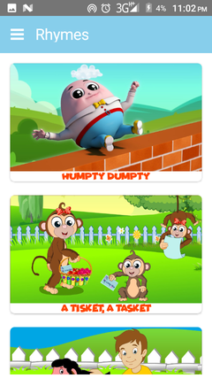
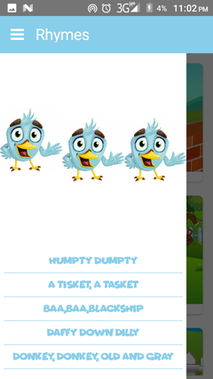

# Rhymes 
Rhymes is a NativeScript-built Android app for children to learn some beautiful and populer rhymes with Related images. 

* [Branches](#branches)
* [Screenshots](#screenshots)
* [Development](#development)
    * [Linting](#linting)
    * [Unit testing](#unit-testing)
    * [Travis CI](#travis)
* [Contributors](#contributors)


<h2 id="branches">Branches</h2>

This repository contains a branche:

* The [**master** branch](https://github.com/Darahat/Rhymes.git) shows how to build a robust, real-world app using NativeScript. The branch is built with vue.js.
This branch targets latest official release of {N}.


<h2 id="screenshots">Screenshots</h2>






## Usage

``` bash
# Install dependencies
npm install

# Build for production
npm run build
npm run build:<platform>

# Build, watch for changes and debug the application
npm run debug
npm run debug:<platform>

# Build, watch for changes and run the application
npm run watch
npm run watch:<platform>

# Clean the NativeScript application instance (i.e. rm -rf dist)
npm run clean
```

> When invoking the various npm scripts, omitting the platform will attempt to launch `tns` for both platforms, which will only work in a properly configured OSX environment.

For detailed instructions, see https://github.com/nativescript-vue/vue-cli-template


